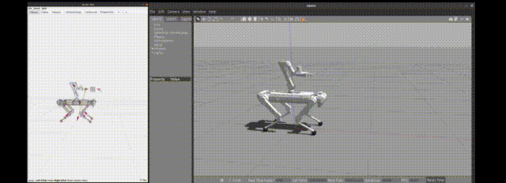
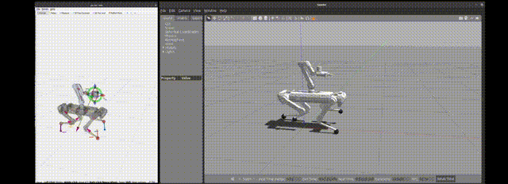
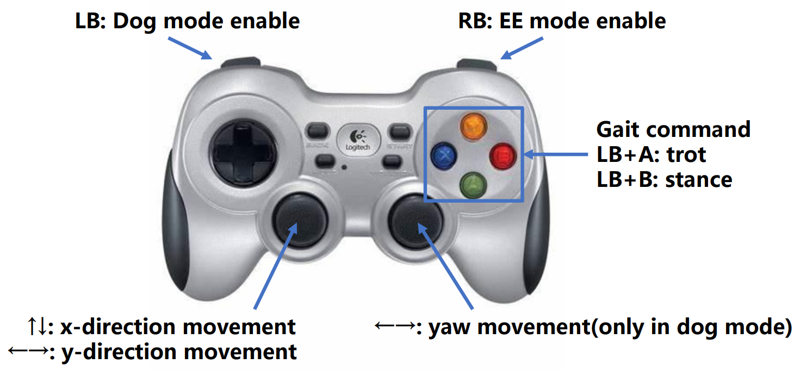

# ATEC2025 Online Challenge Baseline

<table><tr>
<td></td>
</tr></table> 

<table><tr>
<td></td>
</tr></table> 

**Video Links:** [Video_1](https://youtu.be/ssDCgayYm5A) and [Video_2](https://youtu.be/3uMl4_FFygo).

## Overview

This repository provides a baseline program for the ATEC2025 Online Challenge. The baseline aims to offer a clear starting point for participants to build upon, demonstrating the essential setup, algorithmic structures, and configuration required to participate in the challenge. The program implements whole-body motion planning and control for a quadruped robot with a manipulator, serving as a foundation for participants to develop and refine their strategies for optimal performance.

**To learn more about the competition rules, check** [Atec2025_Online_Rules](https://atec-website-pub.oss-cn-beijing.aliyuncs.com/65380f35ad1069efc65b15ac02d152d952487733.mp4): 

The quadruped robot, *Sirius*, is provided by [CUHK LRL](https://cuhkleggedrobotlab.github.io/), and the manipulator, *A1X*, is provided by [Galaxea](https://galaxea.ai/).

## Installation

### Install dependencies

- [OCS2](https://leggedrobotics.github.io/ocs2/installation.html#prerequisites)
- [ROS1-Noetic](http://wiki.ros.org/noetic)

### Clone and Build

```
# Clone
mkdir -p <catkin_ws_name>/src
cd <catkin_ws_name>/src
git clone https://github.com/atecup/ATEC_2025_Online_Challenge_Baseline.git

# Build
cd <catkin_ws_name>
catkin init
catkin config -DCMAKE_BUILD_TYPE=RelWithDebInfo
catkin build
```

***Notes: Make sure OCS2 is in the environment path.***

## Usage

Launch the simulation with:

```
mon launch qm_gazebo empty_world_mpc.launch
```

Load the controller:

```
mon launch qm_controllers load_controller_mpc.launch
```

Start the controller using `rqt_controller_manager` GUI

```
rosrun rqt_controller_manager rqt_controller_manager
```

After the manipulator is initialized, commands can be sent

```
# Don't use mon
roslaunch qm_controllers load_qm_target.launch 
# rviz
mon launch qm_controllers rviz.launch
```

## Gamepad Control

You can use the gamepad to control the quadruped base and the manipulator's end-effector respectively. The schematic diagram of the gamepad is as follows:
<p align = "center">

</p>


## Related Paper  

[1] 张天霖. 基于视觉伺服与集值反馈的四足机械臂动态物体抓取研究 [D]. 哈尔滨: 哈尔滨工业大学, 2024. (for China).  

[2] Zhang, T., Peng, X., Lin, F., Xiong, X., & Lou, Y. (2024, October). Whole-body Compliance Control for Quadruped Manipulator with Actuation Saturation of Joint Torque and Ground Friction. In *2024 IEEE/RSJ International Conference on Intelligent Robots and Systems (IROS)* (pp. 11124-11131). IEEE.

[3] Sleiman, J. P., Farshidian, F., Minniti, M. V., & Hutter, M. (2021). A unified mpc framework for whole-body dynamic locomotion and manipulation. *IEEE Robotics and Automation Letters*, *6*(3), 4688-4695.

## Related Project

[qm_control](https://github.com/skywoodsz/qm_control): Quadruped manipulator controller using model predictive control and whole body control based on OCS2.
